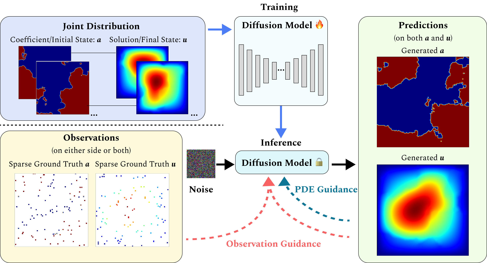

# DiffusionPDE: Generative PDE-Solving Under Partial Observation | NeurIPS 2024

### [Project Page](https://jhhuangchloe.github.io/Diffusion-PDE/) | [Paper](https://arxiv.org/abs/2406.17763)

Official PyTorch implementation.<br>
**DiffusionPDE: Generative PDE-Solving Under Partial Observation**<br>
Jiahe Huang, Guandao Yang, Zichen Wang, Jeong Joon Park<br>
University of Michigan<br>
Stanford University<br>


## Requirements

Python libraries: See [environment.yml](environment.yml) for library dependencies. The conda environment can be set up using these commands:

```.bash
conda env create -f environment.yml -n DiffusionPDE
conda activate DiffusionPDE
```

## Data Generation

All training datasets can be downloaded from [here](https://drive.google.com/file/d/1z4ypsU3JdkAsoY9Px-JSw9RS2f5StNv5/view?usp=sharing) and all test datasets can be downloaded from [here](https://drive.google.com/file/d/1HdkeCKMLvDN_keIBTijOFYrRcA3Quy0l/view?usp=sharing). Unzip the ``training.zip`` folder and the ``testing.zip`` folder in the ``data/`` directory. You can also directly access data files [here](https://drive.google.com/drive/folders/1YbTCcBE6HlUuYNGuf2QVGfbmfTOi3_My?usp=sharing).

Datasets of Darcy Flow, Poisson equation, and Helmholtz equation are of the shape [N, X, Y], where N is the number of instances, and X, Y are spatial resolutions. Datasets of non-bounded and bounded Navier-Stokes equation are of the shape [N, X, Y, T] where T is the number of time steps. Datasets of Burgers' equation are of the shape [N, X, T].

Data generation codes for bounded Navier Stokes equation are derived from [2D Fliud Simulator](https://github.com/takah29/2d-fluid-simulator), and codes for other PDEs are available in the ``dataset_generation`` folder. Specifically, we implemented our data generation over [FNO](https://neuraloperator.github.io/neuraloperator/dev/index.html) and modified the code to introduce more finite difference methods for the Poisson equation and the Helmholtz equation.

## Train Diffusion Models

All pre-trained models can be downloaded from [here](https://drive.google.com/file/d/1w4V0o-nTjpHP_Xv32Rt_SgPGmVa9PwL_/view?usp=sharing). Unzip the ``pretrained-models.zip`` in the root directory.

Our training script is derived from [EDM](https://github.com/NVlabs/edm). To train a new diffusion model on the joint distribution, use, e.g.,

```python
# Prepare the .npy files for training. 
# Raw data in the datasets should be scaled to (-1, 1).
python3 merge_data.py # Darcy Flow

# Train the diffusion model.
torchrun --standalone --nproc_per_node=3 train.py --outdir=pretrained-darcy-new --data=/data/Darcy-merged/ --cond=0 --arch=ddpmpp --batch=60 --batch-gpu=20 --tick=10 --snap=50 --dump=100 --duration=20 --ema=0.05
```

## Solve Forward Problem

To solve the forward problem with sparse observation on the coefficient (or initial state) space, use, e.g.,

```python
python3 generate_pde.py --config configs/darcy-forward.yaml
```

### Solve Inverse Problem

To solve the inverse problem with sparse observation on the solution (or final state) space, use, e.g.,

```python
python3 generate_pde.py --config configs/darcy-inverse.yaml
```

## Recover Both Spaces With Observation On Both Sides

To simultaneously solve coefficient (initial state) space and solution (final state) space with sparse observations on both sides, use, e.g.,

```python
python3 generate_pde.py --config configs/darcy.yaml
```

## Solve Solution Over Time

To recover the solution throughout a time interval with sparse sensors, use, e.g.,

```python
python3 generate_pde.py --config configs/burgers.yaml
```

## Guidance on Guidance Weights

Weights may change depending on the count of observation points. A significant weight can swiftly decrease the error, but an excessively large weight might cause oversaturation and artifacts.

## License

<p xmlns:cc="http://creativecommons.org/ns#" xmlns:dct="http://purl.org/dc/terms/"><span property="dct:title">DiffusionPDE: Generative PDE-Solving Under Partial Observation</span> by <span property="cc:attributionName">Jiahe Huang, Guandao Yang, Zichen Wang, Jeong Joon Park</span> is licensed under <a href="https://creativecommons.org/licenses/by-nc-sa/4.0/?ref=chooser-v1" target="_blank" rel="license noopener noreferrer" style="display:inline-block;">Creative Commons Attribution-NonCommercial-ShareAlike 4.0 International</a>.</p>

``dnnlib, torch_utils, training`` folders, and ``train.py`` are derived from the [codes](https://github.com/NVlabs/edm) by Tero Karras, Miika Aittala, Timo Aila, and Samuli Laine. The codes were originally shared under the [Attribution-NonCommercial-ShareAlike 4.0 International License](https://github.com/NVlabs/edm/blob/main/LICENSE.txt).

Data generation codes for Darcy Flow, Burgers' equation, and non-bounded Navier-Stokes equation are derived from the [codes](https://neuraloperator.github.io/neuraloperator/dev/index.html) by  Zongyi Li, Nikola Kovachki, Kamyar Azizzadenesheli, Burigede Liu, Kaushik Bhattacharya, Andrew Stuart, and Anima Anandkumar. The codes were originally shared under the [MIT license](https://github.com/neuraloperator/neuraloperator/blob/main/LICENSE).

## Citation

```bibtex
@misc{huang2024diffusionpdegenerativepdesolvingpartial,
      title={DiffusionPDE: Generative PDE-Solving Under Partial Observation}, 
      author={Jiahe Huang and Guandao Yang and Zichen Wang and Jeong Joon Park},
      year={2024},
      eprint={2406.17763},
      archivePrefix={arXiv},
      primaryClass={cs.LG}
      url={https://arxiv.org/abs/2406.17763}, 
}
```
